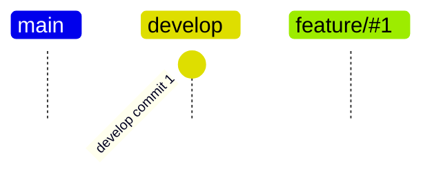
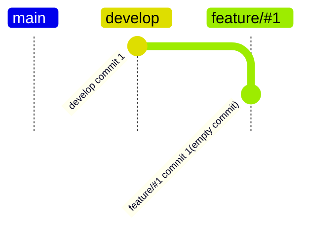
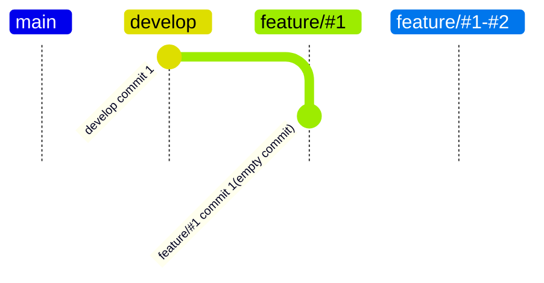
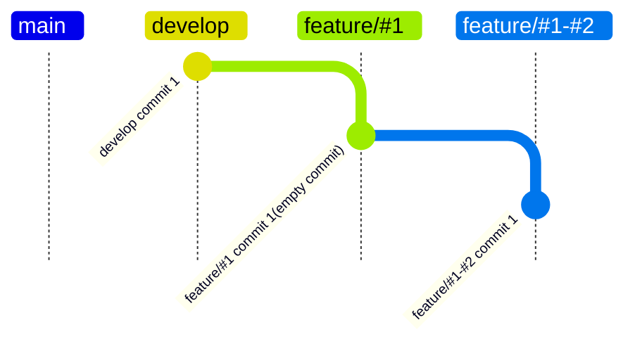
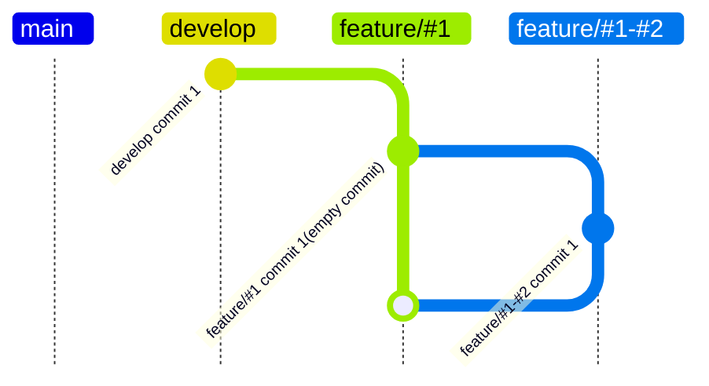
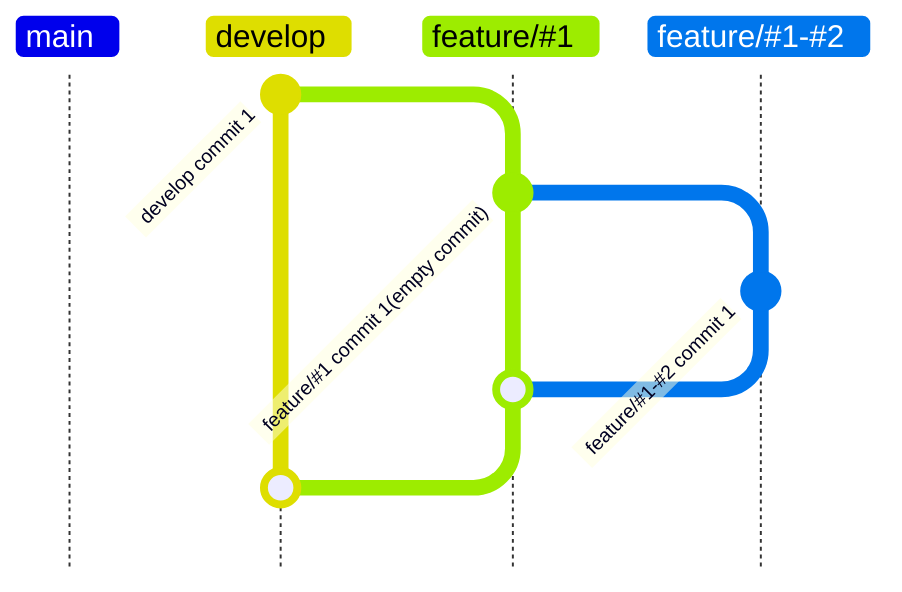

1. 親Issueを作成（`#1`）
1. 子Issueを作成（`#2`）
1. `develop`ブランチからを`feature/#1`ブランチを作成

1. `feature/#1`ブランチで空コミットを行う
```bash
git commit --allow-empty
```
1. `feature/#1`から`develop`へドラフトプルリクエストを作成

1. `feature/#1`ブランチから`feature/#1-#2`ブランチを作成

1. `feature/#1-#2`ブランチでコミットを行う

1. `feature/#1-#2`から`feature/#1`へプルリクエストを行う
1. `feature/#1-#2`から`feature/#1`へのプルリクエストをマージ

1. `feature/#1`から`develop`へのプルリクエストをオープン
1. `feature/#1`から`develop`へのプルリクエストをマージ

