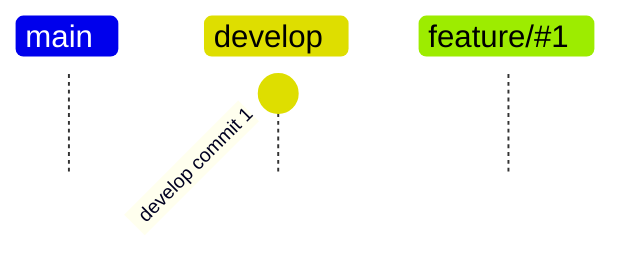
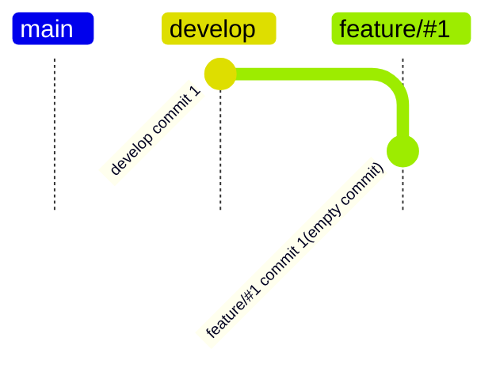
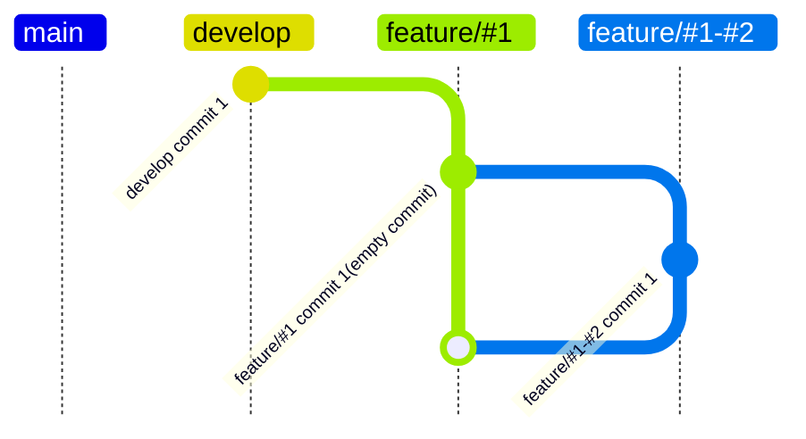
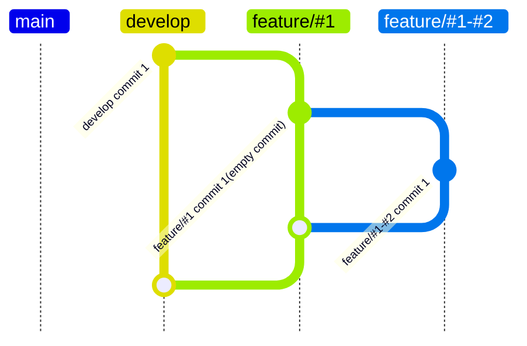

1. 親Issueを作成（`#1`）
2. 子Issueを作成（`#2`）
3. `develop`ブランチからを`feature/#1`ブランチを作成

4. `feature/#1`ブランチで空コミットを行う
```bash
git commit --allow-empty
```
5. `feature/#1`ブランチから`develop`ブランチへドラフトプルリクエストを作成

6. 子タスクが全てマージされるまで繰り返す
    1. `feature/#1`ブランチから`feature/#1-#2`ブランチを作成
    ```mermaid
    gitGraph TB:
        branch "develop"
        commit id: "develop commit 1"
        branch "feature/#1"
        commit id: "feature/#1 commit 1(empty commit)"
        branch "feature/#1-#2"
    ```
    2. `feature/#1-#2`ブランチでコミットを行う
    ```mermaid
    gitGraph TB:
        branch "develop"
        commit id: "develop commit 1"
        branch "feature/#1"
        commit id: "feature/#1 commit 1(empty commit)"
        branch "feature/#1-#2"
        commit id: "feature/#1-#2 commit 1"
    ```
    3. `feature/#1-#2`ブランチから`feature/#1`ブランチへプルリクエストを行う
    4. `feature/#1-#2`ブランチから`feature/#1`ブランチへのプルリクエストをマージ
    ```mermaid
    gitGraph TB:
        branch "develop"
        commit id: "develop commit 1"
        branch "feature/#1"
        commit id: "feature/#1 commit 1(empty commit)"
        branch "feature/#1-#2"
        commit id: "feature/#1-#2 commit 1"
        checkout "feature/#1"
        merge "feature/#1-#2"
    ```
    5. `develop`ブランチに`feature/other`ブランチがマージされていた
    ```mermaid
    gitGraph TB:
        branch "develop"
        commit id: "develop commit 1"
        branch "feature/#1"
        commit id: "feature/#1 commit 1(empty commit)"
        branch "feature/#1-#2"
        commit id: "feature/#1-#2 commit 1"
        checkout "feature/#1"
        merge "feature/#1-#2"
        checkout "develop"
        branch "feature/other"
        commit id: "feature/other commit 1"
        checkout "develop"
        merge "feature/other"
    ```
    6. `feature/#1`ブランチを`develop`に対してリベース
    ```bash
    git rebase --rebase-merge develop
    ```
    ```mermaid
    gitGraph TB:
        branch "develop"
        commit id: "develop commit 1"
        branch "feature/other"
        commit id: "feature/other commit 1"
        checkout "develop"
        merge "feature/other"
        branch "feature/#1"
        commit id: "feature/#1 commit 1"
        branch "feature/#1-#2"
        commit id: "feature/#1-#2 commit 1"
        checkout "feature/#1"
        merge "feature/#1-#2"
    ```
7. `feature/#1`ブランチから`develop`ブランチへのプルリクエストをオープン

8. `feature/#1`ブランチから`develop`ブランチへのプルリクエストをマージされるまで繰り返す
    1. `feature/other`ブランチがマージされた
    ```mermaid
    gitGraph TB:
        branch "develop"
        commit id: "develop commit 1"
        branch "feature/#1"
        commit id: "feature/#1 commit 1(empty commit)"
        branch "feature/#1-#2"
        commit id: "feature/#1-#2 commit 1"
        checkout "feature/#1"
        merge "feature/#1-#2"
        checkout "develop"
        branch "feature/other"
        commit id: "feature/other commit 1"
        checkout "develop"
        merge "feature/other"
    ```
    2. `feature/#1`ブランチを`develop`に対してリベース
    ```bash
    git rebase --rebase-merge develop
    ```
    ```mermaid
    gitGraph TB:
        branch "develop"
        commit id: "develop commit 1"
        branch "feature/other"
        commit id: "feature/other commit 1"
        checkout "develop"
        merge "feature/other"
        branch "feature/#1"
        commit id: "feature/#1 commit 1"
        branch "feature/#1-#2"
        commit id: "feature/#1-#2 commit 1"
        checkout "feature/#1"
        merge "feature/#1-#2"
    ```
9. `feature/#1`ブランチから`develop`ブランチへのプルリクエストをマージ

