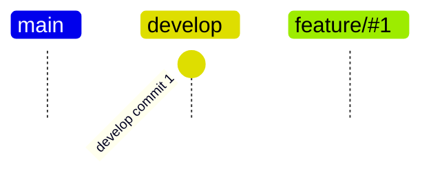
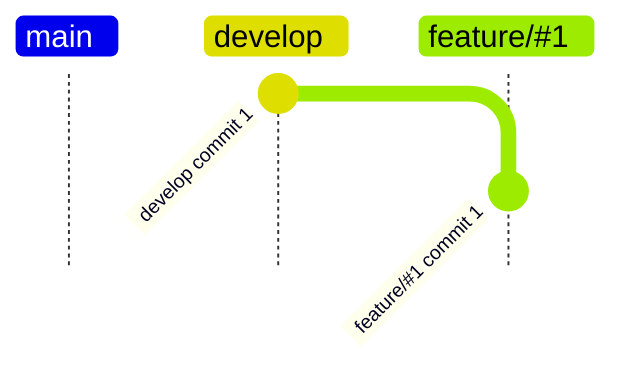
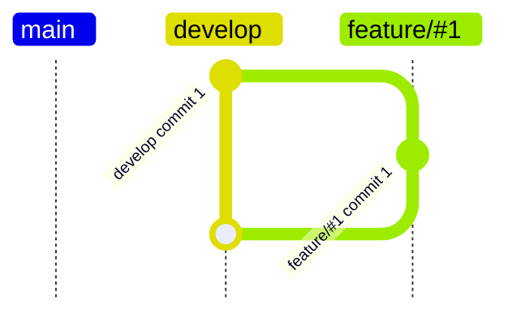

1. Issueを作成（`#1`）
1. `develop`ブランチからを`feature/#1`ブランチを作成

```mermaid
gitGraph TB:
    branch "develop"
    commit id: "develop commit 1"
    branch "feature/#1"
```
1. `feature/#1`ブランチでコミットを行う

```mermaid
gitGraph TB:
    branch "develop"
    commit id: "develop commit 1"
    branch "feature/#1"
    commit id: "feature/#1 commit 1"
```
1. `feature/#1`ブランチから`develop`ブランチへプルリクエストを作成
1. `feature/#1`ブランチから`develop`ブランチへのプルリクエストをマージ

```mermaid
gitGraph TB:
    branch "develop"
    commit id: "develop commit 1"
    branch "feature/#1"
    commit id: "feature/#1 commit 1"
    checkout "develop"
    merge "feature/#1"
```
