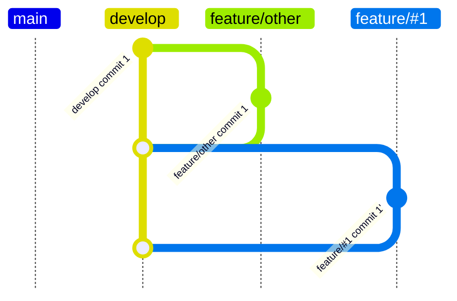

1. Issueを作成（`#1`）
2. `develop`ブランチからを`feature/#1`ブランチを作成

3. `feature/#1`ブランチでコミットを行う

4. `feature/#1`ブランチから`develop`ブランチへプルリクエストを作成
5. `feature/#1`ブランチから`develop`ブランチへのプルリクエストをマージされるまで繰り返す
    1. `feature/other`ブランチがマージされた
    ```mermaid
    gitGraph TB:
        branch "develop"
        commit id: "develop commit 1"
        branch "feature/#1"
        commit id: "feature/#1 commit 1"
        checkout "develop"
        branch "feature/other"
        commit id: "feature/other commit 1"
        checkout "develop"
        merge "feature/other"
    ```
    2. `feature/#1`ブランチを`develop`ブランチに対してリベース
    ```mermaid
    gitGraph TB:
        branch "develop"
        commit id: "develop commit 1"
        branch "feature/other"
        commit id: "feature/other commit 1"
        checkout "develop"
        merge "feature/other"
        branch "feature/#1"
        commit id: "feature/#1 commit 1"
    ```
6. `feature/#1`ブランチから`develop`ブランチへのプルリクエストをマージ

